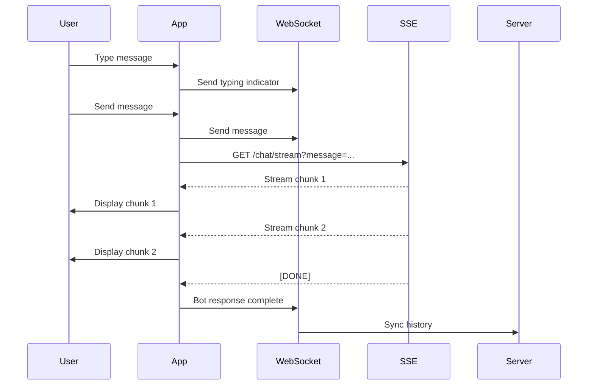

# WebSocket + SSE Integration Documentation

## Architecture Overview

The chat system now uses a hybrid approach combining:
1. **WebSocket** - For persistent connection and real-time bidirectional communication
2. **SSE (Server-Sent Events)** - For streaming bot responses

## Endpoints

### 1. WebSocket Connection
```
ws://35.187.235.34/api/v1/ws/chat/{user_id}?token={access_token}
```
- Maintains persistent connection
- Handles typing indicators
- Syncs message history
- Real-time notifications

### 2. SSE Streaming Endpoint
```
GET http://35.187.235.34/api/v1/chat/stream?message={message}
```
- Streams bot responses in chunks
- Server-Sent Events format
- Progressive response rendering

## Implementation Flow

### User Sends Message:
1. Message saved to chat history
2. Sent via WebSocket for real-time sync
3. SSE endpoint called for streaming response
4. Response chunks displayed progressively
5. Complete response saved to history



## Code Structure

### 1. ChatSSEService (`chat_sse_service.dart`)
- Handles SSE connections
- Processes streaming data
- Manages stream lifecycle

### 2. ChatService (`chat_service.dart`)
- Coordinates WebSocket + SSE
- Method: `sendMessageWithStream()`
- Syncs both channels

### 3. ChatBloc (`chat_bloc.dart`)
- Uses streaming for responses
- Real-time UI updates
- Accumulates chunks

## Features

### Real-time Streaming
- Bot responses appear word-by-word
- No waiting for complete response
- Better UX for long responses

### Hybrid Communication
- WebSocket: Control channel
- SSE: Data streaming channel
- Fallback to regular API if needed

### Typing Indicators
- Auto-sent when user types
- Stops after 2 seconds idle
- Via WebSocket channel

## Testing

### 1. Connection Test
```dart
// Check WebSocket connection
debugPrint('WebSocket connected: ${_chatService.isConnected}');
```

### 2. Send Message with Streaming
```dart
// Message will be sent via WebSocket and response via SSE
await handleSendMessage(); // Automatically uses streaming
```

### 3. Console Output
Look for:
- `🌊 Using SSE streaming for response`
- `📝 SSE chunk: {content}`
- `✅ Streaming response complete`
- `🔌 WebSocket connection state: Connected`

## Configuration

### Enable/Disable Streaming
In `chat_bloc.dart`:
```dart
final useStreaming = true; // Set to false to disable SSE
```

### Fallback Behavior
If SSE fails or is disabled:
1. Falls back to OpenAI API
2. Still uses WebSocket for sync
3. Regular request/response pattern

## Error Handling

### WebSocket Errors
- Auto-reconnect (5 attempts)
- Exponential backoff
- Fallback to API-only mode

### SSE Errors
- Stream closes on error
- Error logged to console
- Fallback to regular API

## Benefits

1. **Better UX**: Progressive response rendering
2. **Lower Latency**: Start showing response immediately
3. **Resilient**: Multiple communication channels
4. **Scalable**: SSE handles long responses efficiently
5. **Real-time**: WebSocket maintains live connection